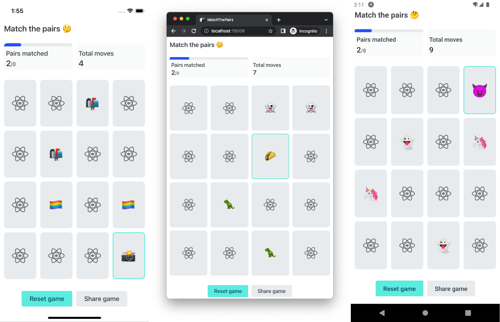

## Expo/React Native Match the Pairs Game

[Design based on Netlify's Deploy Game](https://www.netlify.com/).

A quick game that let's you match 8 pairs of emoji's and share your results.

Features include:

- Randomized list of emojis so you have new emojis each game
- Flip animation with Reanimated
- Share capability with the React Native Share API

## Install

Pre-requisite: You'll need [Expo](https://expo.dev/) installed on your machine.

Clone the Repo: `git clone https://github.com/ReactNativeSchool/match-the-pairs-react-native.git`

Install Depedencies: `yarn install` / `npm install`

## Running the App

- iOS: `yarn ios` / `npm run ios`
- Android: `yarn android` / `npm run android`
- Web: `yarn web` / `npm run web`
